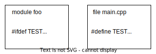
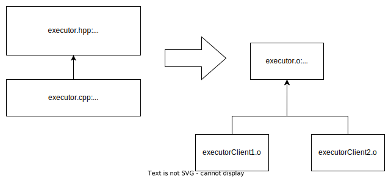

Compilation of a large C++ project can be terribly slow when the project is not structured correctly - structured in a way in fact mimicking modules. Unfortunately this requires deep understanding of linkage and compilation process. These are not most popular and essential parts of the language and as a result are quite often ignored and forgotten. Consequently, projects have tendencies to diverge from optimal structure in terms of compilation speed. The default and the easiest option should be the most efficient, but it's opposite. 
 
### How modules affect linkage?

Modules introduce new term: **module linkage** along with existing external and internal linkages: "The name can be referred to only from the scopes in the same module unit or in the other translation units of the same named module." - en.cppreference.com.

A translation unit is a subset of module unit - multiple translation unit can form one module unit. Translation unit used to be self-contained. All symbols required for compilation had to be declared through included header files. Modules aim to eliminated separate files for providing symbols. How compiler can validate presence of the **Module linkage function** (see picture below) in the **Module unit 1**? During compilation of **Translation unit B** (client to module linkage function contained in **Translation unit A**) it is required to validate if used symbol exists and makes sense.


What's more - a function defined in **Translation unit A** happens to have the same signature as function defined in **Translation unit C**. Which function should linker pick when resolving unresolved symbol encountered in **Translation unit B**? GCC would use first symbol encountered, and it might be ODR violation. Modules however introduce **module linkage** and the same can be referenced to only from the scopes in the same module unit. 

We defined following implementation challenges so far:

1) Symbols from other modules should be accessible during compilation phase
2) There should be no collisions for the same functions define in different module (with module linkage)

Standard does not impose any implementation way so let's examine GCC only. They introduced separate artifacts when compiled named module interfaces, partitions or header units that are read when importing. At moment of writing this article there are no tools available for inspecting content of such artifacts and documentation is lack of details. This is however logical place to put all metadata required to solve **problem 1**.


Linker does not change on each cpp standard update - it barely knows about c++ standard. Linker knows about executable format at specific platform. It knows what are sections and segments and how to update references in compiled assembly to other assembly in other translation unit. Modules are not implemented in linker - the different is how linker sees function with the same signature defined in different translation units.


Symbol `_ZW11moduleUnit13foov` from module 1 is different from symbol `_ZW11moduleUnit23foov` in module 2, even through function signature is the same. This ensures that it is not possible to link against symbol defined in other module, but it is perfectly fine to link against such symbol defined in the same module but in other translation unit (module partitions). 

### Macros and defines are separated

Preprocessor does not only textually copy-paste a code but also decides which section of text should be skipped based on combination of `#defines` and `#ifdefs`. It does not know C++ syntax - is unaware about classes and variables. Everything from its perspective is just a text. 

Heavy reliance on macros is highly discouraged but the fact is that still large codebases are highly depended on them. Sometimes using preprocessor is the only elegant way to solve a problem (serializing and deserializing libraries without reflection). Sometimes programmers are used to solve problems in certain ways and don't update knowledge about best practices. There are many reasons why preprocessor usage is not and will not be deprecated soon.

At this point modules aim to limit macros related challenges by separation. According to proposal: "macros and preprocessor directives in a module unit should have no effect on the
translation units that import it.". It basically eliminates possibility of sneaky errors as result of `#include` ordering.



### Templates

Templates in standard inclusion model by default result with duplication of definitions across translation units. Every time a file template defined in an include file is copy-pasted into a translation unit following chunk of code is copy-pasted into resulting object file. Modules does not change that behaviour but give more clear semantic way of expressing implicit instantiation of a template. 

For C++11 the only way to avoid copy-pasting template code into multiple translation unit was to implicitly defined then in one translation unit and extern that definition in header file:

```c++
template<class Type>
void execute() {}

extern template void execute<int>();
```

then the template is explicitly instantiate in corresponding cpp file:
```c++
template void execute<int>();
```

it results with having a translation unit with assembly code that other translation units can refer to. The reference is resolved during the linkage.



Executor.hpp defines template body and provides a symbol for a specialised version of the template. Corresponding cpp file contains specialization definition and as a result translation unit will contain assembly code for `execute<int>()` function. If any other translation unit refer to this version of template it will not contain its own version of assembly code because inclusion of executor.hpp file will tell compiler that this symbol is declared here and defined somewhere else (extern). Reference to the symbol will be updated during linkage.

Modules provide similar functionality, but in my opinion with much nicer syntax:

```c++
export {
    template<class Type>
    void execute() {}

    template void execute<int>();
}
```

The syntax above provides a way to tell other modules what is available to them:
1) There is a template that can be specialised in any importing translation unit. In such case importing unit will have its own copy of assembly code.
2) There is exported function `execute<int>()` that is defined in module unit and resulting translation unit. Importing translation units will not have their own copy of assembly code.

### Reachability vs visibility

Modules give a programmer correct and efficient way of defining public interface by default. It means you would have to work hard in order to mimic inefficiency of header files.


Let's consider following example of a library animal:

```cpp
module;

#include <string>

export module animal;

export std::string makeSound() {
 return "Sound";
}
```

Client code does not have to be aware of all symbols in std::string in order to fully use the code. There is a notion of 'reachability' vs 'visibility'. In this case std::string is not visible by client code but is reachable.

```cpp
import animal;

int main() {
 auto s = makeSound();
 printf("%s", s.c_str()); // .c_str() of std::string is reachable but not visible
 // std::string text; // will not compile  unless #include <string> is added
 return 0;
}
```

The example above shows IMHO the most important aspect of modules - efficiency by default. Only exported symbols are visible to a client module. By no means am I saying that it's good practice to provide a library that is not self-sufficient - requiring doing more than just 'import' to fully use their API. But this has to be done consciously by explicitly exporting what is needed. It helps to avoid accidental `#include` bloat! 


 
