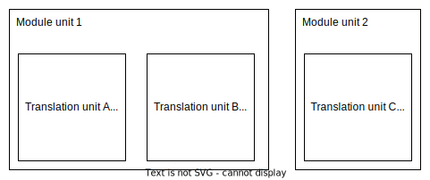

### What challanges modules are trying to solve?

Compilation of a large C++ project can be terriblly slow when the project is not structured correctly - structured in a way in fact mimicking modules. Unfortunately this requires deep undestanding of linkage and compilation process. These are not most popular and essential parts of the laguage and as a result are quite often ignored and forgotten. Consequently projects have tendencies to diverge from optimal structure in terms of compilation speed. The default and the easiest option should be the most efficient but it's opposite. 

Modules give a programmer correct and efficient way of defining public interface by default. It means you would have to work hard in order to mimic inefficieny of header files. 


Let's consider following example of a library animal:

```cpp
module;

#include <string>

export module animal;

export std::string makeSound() {
 return "Wroooarrh";
}
```

Client code does not have to be aware of all symbols in std::string in order to fully use the code. There is a notion of 'reachability' vs 'visibility'. I this case std::string is not visibile by client code but is reachanble.

```cpp
import animal;

int main() {
 auto s = makeSound();
 printf("%s", s.c_str()); // .c_str() of std::string is reachable but not visible
 // std::string text; // will not compile  unlsess #include <string> is added
 return 0;
}
```

The example above shows IMHO the most important aspect of modules - efficiency by default. Only exported symbols are visible to a client module. By no means am I saying that it's good practice to provide a library that is not self-sufficient - that is require doing more than just 'import' to fully use their API. But this has to be done conciously by explicitly exporting what is needed. It helps avoiding accidental `#include` bloat!  

### How modules affect linkage?

Modules introduce new term: **module linkage** along with existing external and internal linkages: "The name can be referred to only from the scopes in the same module unit or in the other translation units of the same named module." - en.cppreference.com.

A translation unit is a subset of module unit - multiple translation unit can form one module unit. Translation unit used to be selft contained. All symbols required for compilation had to be declared throug included header files. Modules aim to elimited separate files for providing symbols. How compiler can validate presence of the **Module linkage function** (see picture below) in the **Module unit 1**? During compilation of **Translation unit B** (client to module linkage function contained in **Translation unit A**) it is required to validate if used symbol exists and makes sense.



What's more - a function defined in **Translation unit A** happens to have the same signature as function defined in **Translation unit C**. Which function should linker pick when resolving unresolved symbol encountered in **Transation unit B**? GCC would use first symbol encountered and it might be ODR violation. Modules however introduce **module linkage** and the same can be referenced to only from the scopes in the same module unit. 

We defined following implementation challanges so far:

1) Symbols from other modules should be accesible during compilation phase
2) There should be no colisions for the same functions define in different module (with module linkage)

Standard does not impose any implementation way so let's examine GCC only. They introduced separate artifacts when compiled named module interfaces, partitions or header units that are read when importing. At moment of writting this article there are no tools available for inspecting content of such artifacts and documentation is lack of details. This is however logical place to put all metadata required to solve **problem 1**.


Linker does not change on each cpp standard update - it barely knows about c++ standard. Linker knows about executable format at specific platform. It knows what are sections and segments and how to update references in compiled assembly to other assembly in other translation unit. Modules are not implemented in linker - the different is how linker sees function with the same signature defined in different translation units.


Module interface unit - it is module unit whose delcaration contains `export` keyword
```cpp
export module animal;
```

Module implementation unit - it is module unit whose declaratio does not contain `export` keyword

```cpp
module animal;
```

There should be excacly one module intefcae unit with no module-parition within a module. Compiler does not have to output any diagnostic message when is otherwise. In practice g++-13 adds symbol to each moduleand it provides link-time error when multiple definitions are encountered.

```
multiple definition of `_ZGIW6animal'
```

It's generally considered harder to get ODR violation with modules but why?


 
